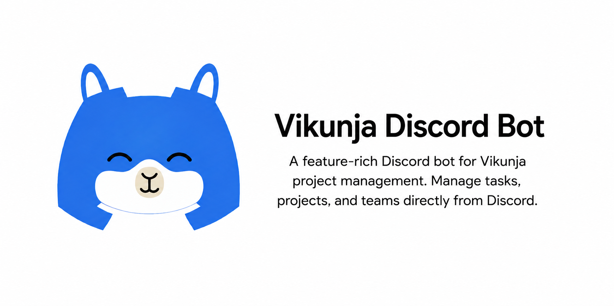
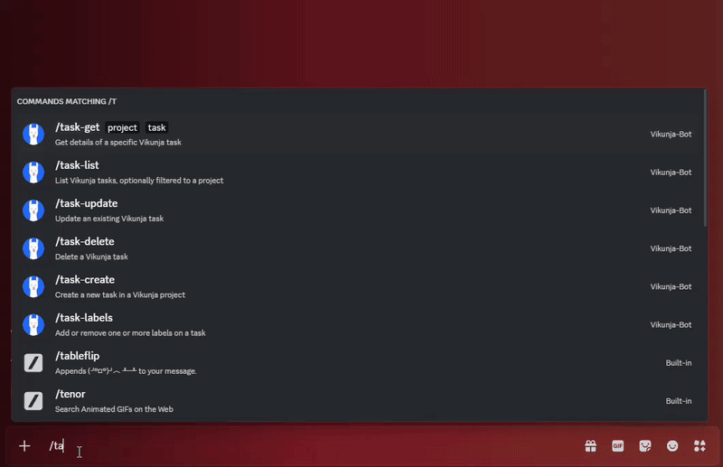
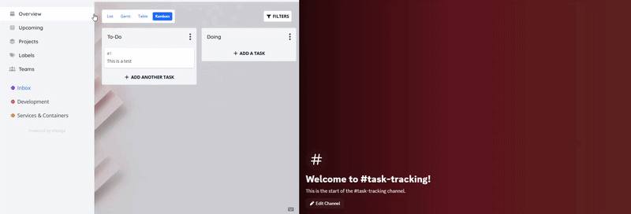

 -   -   - 

---





## How it works

- Slash commands let you create, list, view, update, delete, and manage assignees and reminders on tasks.
- `/webhook-register` creates a Vikunja webhook for a project and can map that project to a Discord channel.
- `/webhook-channel` lets you manage project-to-channel mappings (`set`, `remove`, `list`).
- `/alert-assignee` lets you manage who gets pinged for reminder alerts (`link`, `unlink`, `list`).
- Vikunja sends events to the bot webhook endpoint.
- The bot posts those events to the mapped Discord channel for the matching project.
- Webhook-delivered task embeds include an `Open` link button for the relevant Vikunja page.
- The bot verifies incoming webhook signatures using per-webhook secrets stored in `/data`.

## What you need

- A Discord bot and application token
- A Vikunja instance with an API token
- A publicly reachable URL for the bot webhook endpoint
- Docker and Docker Compose

## Documentation

- [Command reference](docs/COMMANDS.md)
- [Webhook setup](docs/WEBHOOKS.md)

---

## Quick start

### Create the Discord bot (Developer Portal)

1. Go to the Discord Developer Portal: <https://discord.com/developers/applications>
2. Click **New Application**, enter a name, and create it.
3. Open the new application and copy the **Application ID**.
   Use this as `DISCORD_CLIENT_ID` in your `.env`.
4. In **Bot**:
   - Click **Add Bot**
   - Click **Reset Token** (or **Copy**) and save the token
   - Use this as `DISCORD_TOKEN` in your `.env`
5. In **OAuth2 -> URL Generator**:
   - Scopes: `bot`, `applications.commands`
   - Bot Permissions: `Send Messages`, `Embed Links`, `Use Slash Commands`
6. Open the generated URL, choose your server, and authorize the bot.

---

### Set Environment variables

Set these in `.env` in the same folder as your compose file, or ensure you include the path in your docker run command:

| Variable | Required | Purpose |
| --- | --- | --- |
| `TZ` | Yes | Bot timezone |
| `WEBHOOK_PORT` | No | Webhook port (default `3000`) |
| `WEBHOOK_MAX_BODY_KB` | No | Max webhook request body size in KB (default `256`) |
| `BOT_PUBLIC_URL` | Yes | Public base URL for the bot |
| `DISCORD_TOKEN` | Yes | Bot token |
| `DISCORD_CLIENT_ID` | Yes | Application client ID |
| `VIKUNJA_BASE_URL` | Yes | Vikunja base URL |
| `VIKUNJA_API_TOKEN` | Yes | Vikunja API token |

### Deploy the service

Docker-compose:

```yaml
services:
  vikunja-discord-bot:
    image: adambeckett1999/vikunja-discord-bot:latest
    container_name: vikunja-discord-bot
    restart: unless-stopped
    security_opt:
      - no-new-privileges:true
    cap_drop:
      - ALL
    env_file:
      - .env
    ports:
      - "${WEBHOOK_PORT:-3000}:${WEBHOOK_PORT:-3000}"
    volumes:
      - vikunja-discord-bot-data:/data

volumes:
  vikunja-discord-bot-data:
```

Manual run:

```bash
docker run --rm -p ${WEBHOOK_PORT:-3000}:${WEBHOOK_PORT:-3000} -v vikunja-discord-bot-data:/data --env-file /YOUR/FILE/LOCATION/HERE/.env adambeckett1999/vikunja-discord-bot:latest
```

Once the container is running, the slash commands should register within discord. You may need to check the permissions on your bot within the server.

The bot should already be invited to the server before the container starts so the deploy step can discover it automatically. If you add the bot to a server after the container is already running, restart the container so command deployment can re-authenticate and pick up the new guild.

## Support And Feedback

If there are features you would like to see, or bugs and issues that need addressing, please create an issue.
